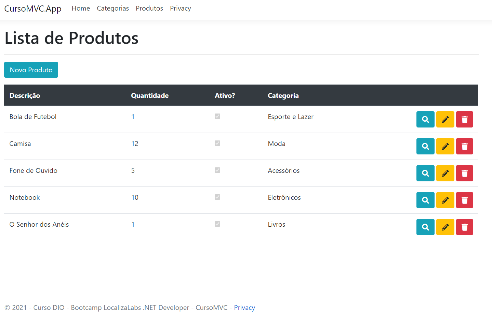
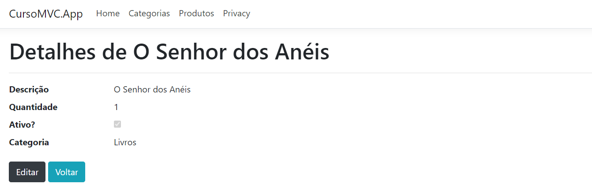
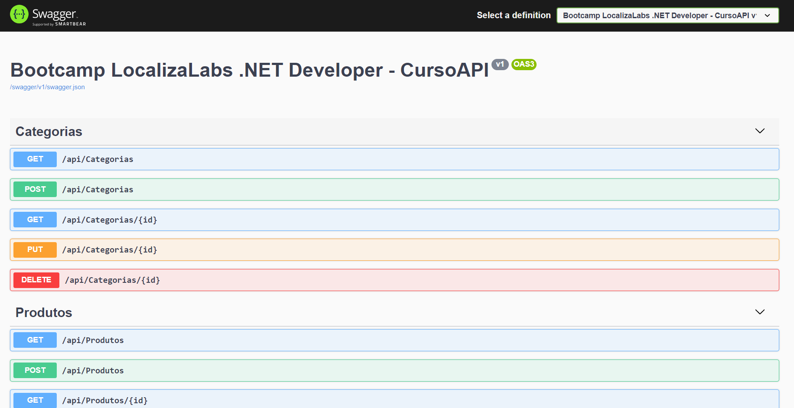

<h1 align="center">Bootcamp LocalizaLabs .NET Developer</h1>

<p align="center">Implementações de exercícios de programação do Bootcamp LocalizaLabs .NET Developer</p>

## :clipboard: Exercícios

Soluções de Problemas em C#
* [Consumo Médio do Automóvel](https://github.com/YuriSiman/bootcamp-localizalabs-dotnet/#consumo-m%C3%A9dio-do-autom%C3%B3vel)  
* [DDD](https://github.com/YuriSiman/bootcamp-localizalabs-dotnet/#ddd)  
* [Aumento de Salário](https://github.com/YuriSiman/bootcamp-localizalabs-dotnet/#aumento-de-salário)  

Criando uma Aplicação de Transferências Bancárias com .NET 
* [Transferência Bancária](https://github.com/YuriSiman/bootcamp-localizalabs-dotnet/#transferência-bancária)  

Desafios Aritméticos em C#
* [Média](https://github.com/YuriSiman/bootcamp-localizalabs-dotnet/#média)  
* [Crescimento Populacional](https://github.com/YuriSiman/bootcamp-localizalabs-dotnet/#crescimento-populacional)  
* [Bazinga!](https://github.com/YuriSiman/bootcamp-localizalabs-dotnet/#bazinga)  
* [Tempo de um Evento](https://github.com/YuriSiman/bootcamp-localizalabs-dotnet/#tempo-de-um-evento)  
* [Comunicação em Piralândia](https://github.com/YuriSiman/bootcamp-localizalabs-dotnet/#comunicação-em-piralândia)  

Criando um APP simples de cadastro de séries em .NET
* [Cadastro de Séries](https://github.com/YuriSiman/bootcamp-localizalabs-dotnet/#cadastro-de-séries)  

Introdução à orquestração de conteiners com Docker
* [Docker](https://github.com/YuriSiman/bootcamp-localizalabs-dotnet/#docker)  

Desenvolvimento de Aplicações com .NET
* [CursoMVC - CursoAPI](https://github.com/YuriSiman/bootcamp-localizalabs-dotnet/#cursomvc---cursoapi)  

Projeto .NET de Crowdfunding
* [Crowdfunding](https://github.com/YuriSiman/bootcamp-localizalabs-dotnet/#crowdfunding)  

Praticando Programação em C#
* [Coordenadas de um Ponto](https://github.com/YuriSiman/bootcamp-localizalabs-dotnet/#coordenadas-de-um-ponto)  
* [Compras no Supermercado](https://github.com/YuriSiman/bootcamp-localizalabs-dotnet/#compras-no-supermercado)  
* [Pink e Cérebro](https://github.com/YuriSiman/bootcamp-localizalabs-dotnet/#pink-e-cérebro)  

---

### :dart: Objetivo

Tenho como objetivo implementar as atividades propostas pelo Bootcamp LocalizaLabs .NET Developer. São exercícios de programação focados em C# e dotnet.

### Clone

Clone este repositório em sua máquina local usando:

```
git clone https://github.com/YuriSiman/bootcamp-localizalabs-dotnet.git
```

---

## :rocket: Vamos Começar 

### Soluções de Problemas em C#

## Consumo Médio do Automóvel 

**Desafio**  
Você deve calcular o consumo médio de um automóvel onde será informada a distância total percorrida (em Km) e o total de combustível consumido (em litros).  

**Entrada**  
Você receberá dois valores: um valor inteiro X com a distância total percorrida (em Km), e um valor real Y que representa o total de combustível consumido, com um dígito após o ponto decimal.  

**Saída**  
Exiba o valor que representa o consumo médio do automóvel (3 casas após a vírgula), incluindo no final a mensagem "km/l".  

Exemplo de Entrada | Exemplo de Saída
------------ | -------------
Distância: 500 - Combustível Gasto: 35,0 | 14,286 km/l
Distância: 2254 - Combustível Gasto: 124,4 | 18,119 km/l
Distância: 4554 - Combustível Gasto: 464,6 | 9,802 km/l


* [Visualizar Código](https://github.com/YuriSiman/bootcamp-localizalabs-dotnet/blob/master/src/1%20-%20Solu%C3%A7%C3%A3o%20de%20Problemas%20em%20CSharp/Consumo%20M%C3%A9dio%20do%20Autom%C3%B3vel/Program.cs)  
* [Voltar ao Início](https://github.com/YuriSiman/bootcamp-localizalabs-dotnet#bootcamp-localizalabs-net-developer)  

---

## DDD

**Desafio**  
Leia um número inteiro que representa um código de DDD para discagem interurbana. Em seguida, informe à qual cidade o DDD pertence, considerando a tabela abaixo:  

DDD | Destination
------------ | -------------
61 | Brasília
71 | Salvador
11 | São Paulo
21 | Rio de Janeiro
32 | Juiz de Fora
19 | Campinas
27 | Vitória
31 | Belo Horizonte  

Se a entrada for qualquer outro DDD que não esteja presente na tabela acima, o programa deverá informar:  
``` DDD não cadastrado ```


**Entrada**  
A entrada consiste de um único valor inteiro.  

**Saída**  
Imprima o nome da cidade correspondente ao DDD existente na entrada. Imprima DDD nao cadastrado caso não existir DDD correspondente ao número digitado.  

Exemplo de Entrada | Exemplo de Saída
------------ | -------------
11 | São Paulo

* [Visualizar Código](https://github.com/YuriSiman/bootcamp-localizalabs-dotnet/blob/master/src/1%20-%20Solu%C3%A7%C3%A3o%20de%20Problemas%20em%20CSharp/DDD/Program.cs)  
* [Voltar ao Início](https://github.com/YuriSiman/bootcamp-localizalabs-dotnet#bootcamp-localizalabs-net-developer)  

---

## Aumento de Salário

**Desafio**  
A empresa ABC resolveu conceder um aumento de salários a seus funcionários de acordo com a tabela abaixo:  

Salário | Percentual de Reajuste
------------ | -------------
0 - 400.00 | 15%
400.01 - 800.00 | 12%
800.01 - 1200.00 | 10%
1200.01 - 2000.00 | 7%
Acima de 2000.00 | 4%

Leia o salário do funcionário e calcule e mostre o novo salário, bem como o valor de reajuste ganho e o índice reajustado, em percentual.  

**Entrada**  
A entrada contém apenas um valor de ponto flutuante, que pode ser maior ou igual a zero, com duas casas decimais.  

**Saída**  
Imprima 3 linhas na saída: o novo salário, o valor ganho de reajuste e o percentual de reajuste ganho, conforme exemplo abaixo.  

Exemplo de Entrada | Exemplo de Saída
------------ | -------------
400.00 | Novo salario: 460.00 - Reajuste ganho: 60.00 - Em percentual: 15 %
800.01 | Novo salario: 880.01 - Reajuste ganho: 80.00 - Em percentual: 10 %
2000.00 | Novo salario: 2140.00 - Reajuste ganho: 140.00 - Em percentual: 7 %


* [Visualizar Código](https://github.com/YuriSiman/bootcamp-localizalabs-dotnet/blob/master/src/1%20-%20Solu%C3%A7%C3%A3o%20de%20Problemas%20em%20CSharp/Aumento%20de%20Sal%C3%A1rio/Program.cs)  
* [Voltar ao Início](https://github.com/YuriSiman/bootcamp-localizalabs-dotnet#bootcamp-localizalabs-net-developer)  

---

### Criando uma Aplicação de Transferências Bancárias com .NET

## Transferência Bancária

**Desafio**  
Criando uma aplicação de transferência bancária com .NET e C#.  
Aprenda como criar um algoritmo simples de transferência bancária para exercer o pensamento orientado a objetos, o principal paradigma de programação utilizado no mercado. Nesse projeto você vai aprender: Como pensar orientado a objetos, como modelar o seu domínio, como utilizar enums.


* [Visualizar Código](https://github.com/YuriSiman/bootcamp-localizalabs-dotnet/tree/master/src/2%20-%20Criando%20uma%20Aplica%C3%A7%C3%A3o%20de%20Transfer%C3%AAncias%20Banc%C3%A1rias%20com%20.NET/Transfer%C3%AAncias%20Banc%C3%A1rias)  
* [Voltar ao Início](https://github.com/YuriSiman/bootcamp-localizalabs-dotnet#bootcamp-localizalabs-net-developer)  

---

### Desafios Aritméticos em C#

## Média

**Desafio**  
Leia 2 valores de ponto flutuante de dupla precisão A e B, que correspondem a 2 notas de um aluno. A seguir, calcule a média do aluno, sabendo que a nota A tem peso 3.5 e a nota B tem peso 7.5 (A soma dos pesos portanto é 11). Assuma que cada nota pode ir de 0 até 10.0, sempre com uma casa decimal.  

**Entrada**  
O arquivo de entrada contém 2 valores com uma casa decimal cada um.  

**Saída**  
Calcule e imprima a variável MEDIA conforme exemplo abaixo, com 5 dígitos após o ponto decimal e com um espaço em branco antes e depois da igualdade. Utilize variáveis de dupla precisão (double) e como todos os problemas, não esqueça de imprimir o fim de linha após o resultado, caso contrário, você receberá "Presentation Error".  

Exemplo de Entrada | Exemplo de Saída
------------ | -------------
5.0 - 7.1 | MEDIA = 6.43182
0.0 - 7.1 | MEDIA = 4.84091
10.0 - 10.0 | MEDIA = 10.00000

* [Visualizar Código](https://github.com/YuriSiman/bootcamp-localizalabs-dotnet/blob/master/src/3%20-%20Desafios%20Aritm%C3%A9ticos%20em%20CSharp/M%C3%A9dia/Program.cs)  
* [Voltar ao Início](https://github.com/YuriSiman/bootcamp-localizalabs-dotnet#bootcamp-localizalabs-net-developer)  

---

## Crescimento Populacional

**Desafio**  
O Governador do Estado quer saber sobre as taxas de crescimento das cidades. De acordo com dados da população e a taxa de crescimento de duas cidades quaisquer (A e B), ele quer que você calcule quantos anos levará para que a cidade menor (A) cresça mais em população que a cidade maior (B).

Claro que o Governador quer saber apenas para as cidades cuja taxa de crescimento da cidade A é maior do que a taxa de crescimento da cidade B, portanto, previamente já separou para você apenas os casos de teste que tem a taxa de crescimento maior para a cidade A.

Desenvolva um programa que apresente o tempo, em anos, para cada caso.

Porém, em alguns casos o tempo pode ser muito grande, e o Governador não se interessa em saber exatamente o tempo para estes casos, já que ele pode não estar mais eleito. Basta que você informe, nesta situação, a mensagem "Mais de 1 século.".  

**Entrada**  
A primeira linha da entrada contém um único inteiro T, indicando o número de casos de teste (1 ≤ T ≤ 3000). Cada caso de teste contém 4 números: dois inteiros PA e PB (100 ≤ PA < 1000000, PA < PB ≤ 1000000) indicando respectivamente a população de A e B, e dois valores G1 e G2 (0.1 ≤ G1 ≤ 10.0, 0.0 ≤ G2 ≤ 10.0, G2 < G1) com um digito após o ponto decimal cada, indicando respectivamente o crescimento populacional de A e B (em percentual).

**Atenção:** A população é sempre um valor inteiro, portanto, um crescimento de 2.5 % sobre uma população de 100 pessoas resultará em 102 pessoas, e não 102.5 pessoas, enquanto um crescimento de 2.5% sobre uma população de 1000 pessoas resultará em 1025 pessoas. Além disso, não utilize variáveis de precisão simples para as taxas de crescimento.  

**Saída**  
Imprima, para cada caso de teste, quantos anos levará para que a cidade A ultrapasse a cidade B em número de habitantes. Obs.: se o tempo for mais do que 100 anos o programa deve apresentar a mensagem: Mais de 1 seculo. Neste caso, é melhor interromper o programa imediatamente após passar de 100 anos, caso contrário você poderá receber como resposta da submissão deste problema "Time Limit Exceeded".  

Exemplo de Entrada | Exemplo de Saída
------------ | -------------
6 | 
100 150 1.0 0 | 51 anos.
90000 120000 5.5 3.5 | 16 anos.
56700 72000 5.2 3.0 | 12 anos.
123 2000 3.0 2.0 | Mais de 1 seculo.
100000 110000 1.5 0.5 | 10 anos.
62422 484317 3.1 1.0 | 100 anos.

* [Visualizar Código](https://github.com/YuriSiman/bootcamp-localizalabs-dotnet/blob/master/src/3%20-%20Desafios%20Aritm%C3%A9ticos%20em%20CSharp/Crescimento%20Populacional/Program.cs)  
* [Voltar ao Início](https://github.com/YuriSiman/bootcamp-localizalabs-dotnet#bootcamp-localizalabs-net-developer)  

---

## Bazinga!

**Desafio**  
Em um episódio da aclamada série The Big Ban Theor dois pernagens, Sheldon e Raj, discutem qual dos dois é o melhor: o filme Saturn 3 ou a série Deep Space 9. A sugestão de Raj para a resolução do impasse é uma disputa de Pedra-Papel-Tesoura. Contudo, Sheldon argumenta que, se as partes envolvidas se conhecem, entre 75% e 80% das disputas de Pedra-Papel-Tesoura terminam empatadas, e então sugere o Pedra-Papel-Tesoura-Lagarto-Spock.

As regras do jogo proposto são:

1. a tesoura corta o papel;
2. o papel embrulha a pedra;
3. a pedra esmaga o lagarto;
4. o lagarto envenena Spock;
5. Spock destrói a tesoura;
6. a tesoura decapita o lagarto;
7. o lagarto come o papel;
8. o papel contesta Spock;
9. Spock vaporiza a pedra;
10. a pedra quebra a tesoura.  

Conhecendo os personagens, sabemos que caso Sheldon vencesse, ele gritaria a vitória com um "Bazinga!". Se Raj vencesse, Sheldon o acusaria de ter trapaceado. Agora, se desse empate, Sheldon não descansaria e insistira para jogarem de novo até que seja decidido. Sabendo dessas ações, faça um programa que imprima a provável reação de Sheldon.  

**Entrada**  
A entrada consiste em uma série de casos de teste. A primeira linha contém um inteiro positivo T (T ≤ 100), que representa o número de casos de teste. Cada caso de teste é representado por uma linha da entrada, contendo as escolhas de Sheldon e Raj, respectivamente, separadas por um espaço em branco. As escolhas possíveis são as personagens do jogo: pedra, papel, tesoura, lagarto e Spock.  

**Saída**  
Para cada caso de teste deverá ser impressa a mensagem "Caso #t: R", onde t é o número do caso de teste (cuja contagem se inicia no número um) e R é uma das três reações possíveis de Sheldon: "Bazinga!", "Raj trapaceou!", ou "De novo!".  

Exemplo de Entrada | Exemplo de Saída
------------ | -------------
3 | 
papel pedra | Caso #1: Bazinga!
lagarto tesoura | Caso #2: Raj trapaceou!
Spock Spock | Caso #3: De novo!

* [Visualizar Código](https://github.com/YuriSiman/bootcamp-localizalabs-dotnet/blob/master/src/3%20-%20Desafios%20Aritm%C3%A9ticos%20em%20CSharp/Bazinga!/Program.cs)  
* [Voltar ao Início](https://github.com/YuriSiman/bootcamp-localizalabs-dotnet#bootcamp-localizalabs-net-developer)  

---

## Tempo de um Evento

**Desafio**  

Pedrinho está organizando um evento em sua Universidade. O evento deverá ser no mês de Abril, iniciando e terminando dentro do mês. O problema é que Pedrinho quer calcular o tempo que o evento vai durar, uma vez que ele sabe quando inicia e quando termina o evento.

Sabendo que o evento pode durar de poucos segundos a vários dias, você deverá ajudar Pedrinho a calcular a duração deste evento.  

**Entrada**  
Como entrada, na primeira linha vai haver a descrição “Dia”, seguido de um espaço e o dia do mês no qual o evento vai começar. Na linha seguinte, será informado o momento no qual o evento vai iniciar, no formato hh : mm : ss. Na terceira e quarta linha de entrada haverá outra informação no mesmo formato das duas primeiras linhas, indicando o término do evento.  

**Saída**  
Na saída, deve ser apresentada a duração do evento, no seguinte formato:

W dia(s)
X hora(s)
Y minuto(s)
Z segundo(s)

Obs: Considere que o evento do caso de teste para o problema tem duração mínima de 1 minuto.  

Exemplo de Entrada | Exemplo de Saída
------------ | -------------
Dia 5 | 3 dia(s)
08 : 12 : 23 | 22 hora(s)
Dia 9 | 1 minuto(s)
06 : 13 : 23 | 0 segundo(s)

* [Visualizar Código](https://github.com/YuriSiman/bootcamp-localizalabs-dotnet/blob/master/src/3%20-%20Desafios%20Aritm%C3%A9ticos%20em%20CSharp/Tempo%20de%20um%20Evento/Program.cs)  
* [Voltar ao Início](https://github.com/YuriSiman/bootcamp-localizalabs-dotnet#bootcamp-localizalabs-net-developer)  

---

## Comunicação em Piralândia

**Desafio**  
Os cientistas brasileiros descobriram um exoplaneta a 1 bilhão de anos luz da terra. Ele foi carinhosamente batizado de Piralândia, uma homenagem a cidade de Piracicaba, onde moram os cientistas. Após algum tempo observando esse planeta, os cientistas puderam ver que nele haviam habitantes e, além disso, esses habitantes estavam tentando fazer contato com os cientistas através de uma comunicação numérica. 

Só que a numeração que encontraram estava invertida e como muitas delas foram descobertas, os cientistas chamaram você para conseguir automatizar esse processo. Logo, dado um número grande, sua tarefa é imprimir esse número invertido.  

**Entrada**  
O arquivo contém apenas uma linha de teste que é o número encontrado (0 < n < 9999999999).

Obs.: Perceba que o número lido é muito alto para armazenar em uma variável do tipo int, logo você irá precisar utilizar o tipo long, que para a leitura e impressão em C, você deve utilizar o %llu.  

**Saída**  
Imprimir o número lido invertido. Não esqueça de imprimir a quebra de linha (\n) no final, caso contrário você receberá (Presentation Error).  

Exemplo de Entrada | Exemplo de Saída
------------ | -------------
1234 | 4321
9876543210 | 0123456789

* [Visualizar Código](https://github.com/YuriSiman/bootcamp-localizalabs-dotnet/blob/master/src/3%20-%20Desafios%20Aritm%C3%A9ticos%20em%20CSharp/Comunica%C3%A7%C3%A3o%20em%20Piral%C3%A2ndia/Program.cs)  
* [Voltar ao Início](https://github.com/YuriSiman/bootcamp-localizalabs-dotnet#bootcamp-localizalabs-net-developer)  

---

### Criando um APP simples de cadastro de séries em .NET

## Cadastro de Séries

**Desafio**  
Aprenda como criar um algoritmo simples de cadastro de séries para praticar seus conhecimentos de orientação a objetos, o principal paradigma de programação utilizada no mercado. Nesse projeto você vai aprender: Como pensar orientado a objetos, como modelar o seu domínio, como utilizar recursos de coleção.  

* [Visualizar Código](https://github.com/YuriSiman/bootcamp-localizalabs-dotnet/tree/master/src/4%20-%20Criando%20um%20APP%20simples%20de%20cadastro%20de%20s%C3%A9ries%20em%20.NET/Cadastro%20de%20S%C3%A9ries)  
* [Voltar ao Início](https://github.com/YuriSiman/bootcamp-localizalabs-dotnet#bootcamp-localizalabs-net-developer)  

---

### Introdução à orquestração de conteiners com Docker

## Docker

Implementação do último exercício proposto na etapa **Introdução à orquestração de conteiners com Docker** do Bootcamp LocalizaLabs .NET Developer.  

Link para o repositório do exercício: [Docker](https://github.com/YuriSiman/bootcamp-localizalabs-docker)  

* [Voltar ao Início](https://github.com/YuriSiman/bootcamp-localizalabs-dotnet#bootcamp-localizalabs-net-developer)  

---

### Desenvolvimento de Aplicações com .NET

## CursoMVC - CursoAPI

Aprenda sobre o Entity Framework, como criar aplicativos web ASP.NET API e ASP.NET MVC. Você também vai criar testes na aplicação e um projeto com Unit Tests.  

Referente aos projetos implementados, os desenvolvi implementando boas práticas de desenvolvimento, aplicando **Pattern Repository**, mapeando entidades entre Models e ViewModels com **AutoMapper**, criando uma arquitetura distribuída para o projeto MVC com Class Library para a camada de negócios (**Business**), para a camada de dados (**Data**) e para a camada da aplicação MVC (**App**), também foi criado uma API para a utilização das camadas de negócios e dados.

Utilizei o **Entity Framework Core** criando um contexto de dados e implementando um mapeamento com o **Fluent Api**, e para o versionamento do bando de dados, implementeis as **Migrations**.

O projeto segue conforme o que as aulas pedem, basicamente um CRUD completo entre as entidades **Categoria** e **Produto**, porém, o grande diferencial é que implementei de uma forma diferente, fazendo uso de uma arquitetura mais desacoplada, distribuída e de fácil manutenção.

O passo a passo da arquitetura utilizada neste projeto pode ser conferido neste meu [repositório!](https://github.com/YuriSiman/complete-app-crud-aspnetcore-mvc)  

#### Aplicação MVC





#### WebAPI utilizando o Swagger para documentação  



* [Visualizar Código](https://github.com/YuriSiman/bootcamp-localizalabs-dotnet/tree/master/src/5%20-%20Desenvolvimento%20de%20Aplica%C3%A7%C3%B5es%20com%20.NET)  
* [Voltar ao Início](https://github.com/YuriSiman/bootcamp-localizalabs-dotnet#bootcamp-localizalabs-net-developer)  

---

### Implementando sua stack de testes de unidade e integrados em um projeto .NET de Crowdfunding

## Crowdfunding

Que se sentir mais seguro nas entregas de suas aplicações? Aprenda a testar um projeto de crowdfunding (vaquinha online) desenvolvida em .NET Core com a arquitetura MVC. Você irá baixar uma aplicação completa feita por expert e sua missão será implementar a parte de testes desta aplicação. Veja na teoria e na prática os principais conceitos de testes para aumentar a qualidade de entrega de seus projetos com testes de unidade, integrados e TDD.   

Link para o repositório do exercício: [Crowdfunding](https://github.com/YuriSiman/dotnet-vaquinha-tests)  

* [Voltar ao Início](https://github.com/YuriSiman/bootcamp-localizalabs-dotnet#bootcamp-localizalabs-net-developer)  

---

### Praticando Programação em C#  

## Coordenadas de um Ponto  

**Desafio**  
Leia **2** valores com uma casa decimal (x e y), que devem representar as coordenadas de um ponto em um plano. A seguir, determine qual o quadrante ao qual pertence o ponto, ou se está sobre um dos eixos cartesianos ou na origem (x = y = 0).  
Se o ponto estiver na origem, escreva a mensagem **Origem**. Se o ponto estiver sobre um dos eixos escreva **Eixo X** ou **Eixo Y**, conforme for a situação.  

**Entrada**  
A entrada contem as coordenadas de um ponto.    

**Saída**  
A saída deve apresentar o quadrante em que o ponto se encontra.  

Exemplo de Entrada | Exemplo de Saída
------------ | -------------
4.5 -2.2 | Q4
0.1 0.1 | Q1
0.0 0.0 | Origem

* [Visualizar Código](https://github.com/YuriSiman/bootcamp-localizalabs-dotnet/blob/master/src/6%20-%20Praticando%20Programa%C3%A7%C3%A3o%20em%20CSharp/Coordenadas%20de%20um%20Ponto/Program.cs)  
* [Voltar ao Início](https://github.com/YuriSiman/bootcamp-localizalabs-dotnet#bootcamp-localizalabs-net-developer)  

---

## Compras no Supermercado  

**Desafio**  
Pedro trabalha sempre até tarde todos os dias, com isso tem pouco tempo tempo para as tarefas domésticas. Para economizar tempo ele faz a lista de compras do supermercado em um aplicativo e costuma anotar cada item na mesma hora que percebe a falta dele em casa.  
O problema é que o aplicativo não exclui itens duplicados, como Pedro anota o mesmo item mais de uma vez e a lista acaba ficando extensa. Sua tarefa é melhorar o aplicativo de notas desenvolvendo um código que exclua os itens duplicados da lista de compras e que os ordene alfabeticamente.  

**Entrada**  
A primeira linha de entrada contém um inteiro **N** (N < 100) com a quantidade de casos de teste que vem a seguir, ou melhor, a quantidade de listas de compras para organizar. Cada lista de compra consiste de uma única linha que contém de 1 a 1000 itens ou palavras compostas apenas de letras minúsculas (de 1 a 20 letras), sem acentos e separadas por um espaço.  

**Saída**  
A saída contém **N** linhas, cada uma representando uma lista de compra, sem os itens repetidos e em ordem alfabética.  

Exemplo de Entrada | Exemplo de Saída
------------ | -------------
2 |
carne laranja suco picles laranja picles | carne laranja picles suco
laranja pera laranja pera pera | laranja pera

* [Visualizar Código](https://github.com/YuriSiman/bootcamp-localizalabs-dotnet/blob/master/src/6%20-%20Praticando%20Programa%C3%A7%C3%A3o%20em%20CSharp/Compras%20no%20Supermercado/Program.cs)  
* [Voltar ao Início](https://github.com/YuriSiman/bootcamp-localizalabs-dotnet#bootcamp-localizalabs-net-developer)  

---

## Pink e Cérebro  

**Desafio**  
Pink e Cérebro dividem um apartamento e estão juntos 24h por dia desde o começo da pandemia. Para passar o temp, Pink cria problemas matemáticos para Cérebro resolver, o último deles foi uma lista de números com a seguinte pergunta: quantos números da lista são múltiplos de **2, 3, 4 e 5**?  
Apesar de parecer simples, porém, quando a lista contém muitos números, Cérebro se confunde e acaba errando alguns cálculos. Ajude Cérebro a resolver o desadio de Pink.  

**Entrada**  
A primeira linha da entrada consiste em um inteiro **N** (1 ≤ N ≤1000), representando a quantidade de números na lista de Pink. A segunda linha contém **N** inteiros Li (1 ≤ Li ≤ 100), representando os números da lista de Pink.  

**Saída**  
Imprima a quantidade de números múltiplos de **2, 3, 4 e 5** presentes na lista. Observe a formatação da saída nos exemplos, pois ela deve ser seguida rigorosamente.  

Exemplo de Entrada | Exemplo de Saída
------------ | -------------
5 |
2 5 4 20 10 | 4 Multiplo(s) de 2 - 0 Multiplo(s) de 3 - 2 Multiplo(s) de 4 - 3 Multiplo(s) de 5

* [Visualizar Código](https://github.com/YuriSiman/bootcamp-localizalabs-dotnet/blob/master/src/6%20-%20Praticando%20Programa%C3%A7%C3%A3o%20em%20CSharp/Pink%20e%20C%C3%A9rebro/Program.cs)  
* [Voltar ao Início](https://github.com/YuriSiman/bootcamp-localizalabs-dotnet#bootcamp-localizalabs-net-developer)  

---

## :vertical_traffic_light: Status do Projeto

:construction: Atividades do Bootcamp sendo implementadas :construction:

---

## :thinking: Contribuindo

> Para começar...

### Passo 1

* :fork_and_knife: Fork este repositório!

### Passo 2

* :dancers: Clone este repositório para sua máquina local usando `git clone https://github.com/YuriSiman/bootcamp-localizalabs-dotnet.git`

### Passo 3

* :trident: Crie sua feature branch usando `git checkout -b minha-feature`

### Passo 4

* :white_check_mark: Commit suas mudanças usando `git commit -m "feat: Minha nova feature"`

### Passo 5

* :pushpin: Dê um push usando `git push -u origin minha-feature`

### Passo 6

* :arrows_clockwise: Crie um novo pull request

Depois que seu pull request for mesclado, você pode excluir sua feature branch  

> Caso tenha dúvidas, confira este guia de como [contribuir no GitHub](https://github.com/firstcontributions/first-contributions)  

---

## :speech_balloon: Suporte

> Entre em contato comigo...  

* Me chame pelo [Linkedin](https://www.linkedin.com/in/yurisiman/)  
* Me mande um e-mail [contato@yurisiman.com.br](mailto:contato@yurisiman.com.br)  

[](https://github.com/YuriSiman)  
[](https://yurisiman.com.br)  

---

## :pencil: Licença

[](https://github.com/YuriSiman/bootcamp-localizalabs-dotnet/blob/master/LICENSE)   

---

Code your life...
